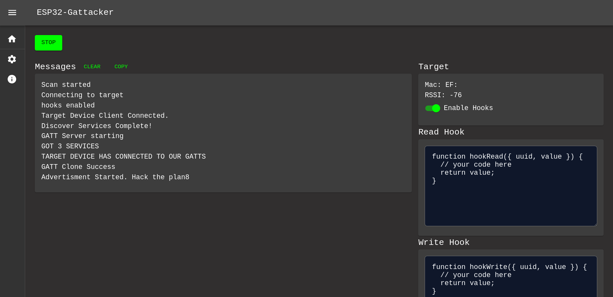

# ESP32-Gattacker

An ESP32 powered implementation of [Gattacker](https://github.com/securing/gattacker) for performing Bluetooth Low Energy MITM (Man-in-the-Middle) attacks.



## Install

Assuming you have an ESP32-S3 with at least 4mb of flash:

The easiest way to install and update will be to get the files from the `Firmware/build/` folder and flash with the following command:

```
esptool.py -p (PORT) -b 460800 --before default_reset --after hard_reset --chip esp32s3  write_flash --flash_mode dio --flash_size detect --flash_freq 80m 0x0 Firmware/build/bootloader/bootloader.bin 0x8000 Firmware/build/partition_table/partition-table.bin 0xe000 Firmware/build/ota_data_initial.bin 0x10000 Firmware/build/gattacker.bin 0x390000 Firmware/build/spiffs.bin
```

Be sure to replace **PORT**

This firmware should support ESP32-C3, ESP32-C2, ESP32-H2 as well yet there are no builds for those yet in this repo.

## Instructions
### Connect to WiFi

The default WiFi creds are:

```
ssid: ESP_WIFI
pass: gattattack
```

If this does not work the WiFi info is printed out in the Serial connection upon boot.

Once you are connected you can go [http://1.3.3.7](http://1.3.3.7) to access the Web UI.

### Web UI Setup

Go to the settings Icon on the left hand side of the webpage and edit your WiFi credentials to your liking. Make sure to click the reboot button after.

Connect to the new network you just setup and head back [to the UI](http://1.3.3.7) to fully utilize your badge.

### Serial

Logging and information can be viewed over serial baud `115200`

## Compile
  * Install VSCode
  * Install ESP-IDF Extension
  * Setup IDF and use version 5.4.1
  * `cd ~/esp/v5.4.1/esp-idf/`
  * `git apply bad_blues.patch` - Apply bad blues patch to esp to get gatt attack to work properly
  * Open repo folder in VSCode
  * Edit `Firmware/partitions.csv` if you want to change from default 4mb
  * In VSCode `Terminal -> Run Build Task`
  * Now you should be able to use 'flash' lightening symbol on bottom bar
  * After flash you can monitor using the button on bottom bar
  * Any of the other ESP VSCode Plugin buttons will now work including the build,flash,monitor command

## Bugs / TODO
* TODO
  * Random WIFI channel/Name
  * MAC Input instead of Scan
  * Broke DNS for captive portal somewhere
* Future TODO:
  - Replaying