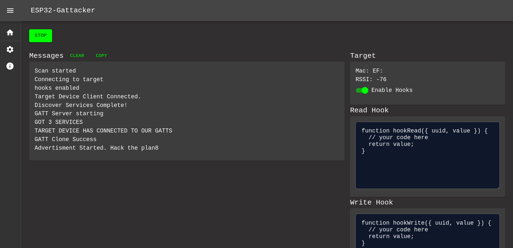

# ESP32-Gattacker

An ESP32 powered implementation of [Gattacker](https://github.com/securing/gattacker) for performing Bluetooth Low Energy MITM (Man-in-the-Middle) attacks.



## Install

Assuming you have an ESP32-S3 with at least 4mb of flash:

1. Download the latest release binary `esp-gattacker-vX.X.X.bin` from the [GitLab Releases Page](https://gitlab.com/p0px/esp32-gattacker/-/releases/permalink/latest).
2. Flash the binary using `esptool.py`:

```bash
esptool.py -p (PORT) -b 460800 write_flash 0x0 esp-gattacker-vX.X.X.bin
```

> [!WARNING]
> Supports ESP32-S3. This command **will overwrite** your NVS partition, meaning any saved WiFi credentials or settings will be lost.

Be sure to replace `(PORT)` with your actual serial port (e.g., `/dev/ttyUSB0` or `COM3`) and `esp-gattacker-vX.X.X.bin` with the actual filename.

## Instructions
### Connect to WiFi

The default WiFi creds are:

```
ssid: ESP_WIFI
pass: gattattack
```

If this does not work the WiFi info is printed out in the Serial connection upon boot.

Once you are connected you can go [http://1.3.3.7](http://1.3.3.7) to access the Web UI.

### Web UI Setup

Go to the settings Icon on the left hand side of the webpage and edit your WiFi credentials to your liking. Make sure to click the reboot button after.

Connect to the new network you just setup and head back [to the UI](http://1.3.3.7) to fully utilize your device.

### Serial

Logging and information can be viewed over serial baud `115200`

## Compile
  * Install VSCode
  * Install ESP-IDF Extension
  * Setup IDF and use version 5.5.2
  * `cd ~/.espressif/v5.5.2/esp-idf/`
  * `git apply bad_blues.patch` - Apply bad blues patch to esp to get gatt attack to work properly
  * Open repo folder in VSCode
  * Edit `Firmware/partitions.csv` if you want to change from default 4mb
  * In VSCode `Terminal -> Run Build Task`
  * Now you should be able to use 'flash' lightening symbol on bottom bar
  * After flash you can monitor using the button on bottom bar
  * Any of the other ESP VSCode Plugin buttons will now work including the build,flash,monitor command

## Bugs / TODO
* TODO
  * Random WIFI channel/Name
* Future TODO:
  - Replaying